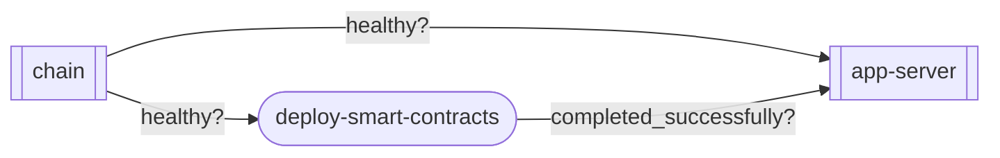

seahaven-project
----------------

[](./LICENSE)
[](https://github.com/LNSD/seahaven-project/actions/workflows/ci.yml)
[](https://codecov.io/gh/LNSD/seahaven-project)

> [!CAUTION]
> This project is currently under active development and not yet production-ready.

<div align="center">
  
</div>

## Getting Started

To begin using Seahaven, follow these simple steps:

1. **Create your project:** Set up a new project in your preferred directory:

   ```bash
   truman init ./my-project
   ```

   This command creates a new project with:
   - A default `setup.yaml` configuration file
   - A generated `docker-compose.yaml` file
   - Basic project structure

2. **Launch your environment:** Move into your project directory and start the development environment in detached mode:

   ```bash
   cd ./my-project
   truman up --detach
   ```

3. **Run a task:** Execute a task defined in your project's `justfile`:

   ```bash
   truman run send-request
   ```

   ```
   Server address: 172.18.0.2:80
   Server name: 153d6be16e08
   Date: 17/Apr/2025:16:06:51 +0000
   URI: /
   Request ID: 657c9cc579c4805c032dd477c8736d91
   ```

4. **Stop the environment:** Stop the development environment and remove the containers, networks, images, and volumes:

   ```bash
   truman down --volumes
   ```

## The `truman` CLI


Truman is your command-line companion for managing Seahaven workspaces. This intuitive CLI tool streamlines your development workflow and environment management.

### Installation

#### `cargo install`

The simplest installation method:

```bash
cargo install seahaven-cli --bin truman --git https://github.com/LNSD/seahaven-project.git --tag vX.Y.Z --locked
```

#### Build from source

For those who prefer building locally:

```bash
git clone https://github.com/LNSD/seahaven-project.git

cargo install --path seahaven-project/seahaven-cli --bin truman
```

### Dependencies

Truman depends on the following tools:

> [!TIP]
> Verify the system dependencies with:
>
> ```bash
> truman system check
> ```

#### Docker

Truman leverages Docker for container orchestration. You'll need:

- Docker Engine
- Docker Compose plugin
- Docker Buildx plugin

Follow the official [Docker installation guide](https://docs.docker.com/get-docker/) to set up these components.

#### Just

Truman's `run` command utilizes Just, a modern command runner:

- Just (version 1.21.0 or later)

Install Just by following the [official instructions](https://github.com/casey/just#installation).

### Next steps

The Truman CLI provides a comprehensive set of commands to manage your development environment:

```bash
truman --help
```

```
The CLI tool that helps you manage your local development environment setup with the ease of a well-scripted reality.

"𝑰𝒏 𝒄𝒂𝒔𝒆 𝑰 𝒅𝒐𝒏'𝒕 𝒔𝒆𝒆 𝒚𝒂, 𝒈𝒐𝒐𝒅 𝒂𝒇𝒕𝒆𝒓𝒏𝒐𝒐𝒏, 𝒈𝒐𝒐𝒅 𝒆𝒗𝒆𝒏𝒊𝒏𝒈, 𝒂𝒏𝒅 𝒈𝒐𝒐𝒅 𝒏𝒊𝒈𝒉𝒕!" — Truman Burbank


Usage: truman [COMMAND]

Commands:
  init         Initialize a new Seahaven project
  build        Build the development environment images using docker compose
  up           Start the development environment using docker compose
  down         Stop and remove containers, networks, images, and volumes
  pull         Pull the images for the development environment
  run          run the development environment images using docker compose
  logs         View output from the containers
  ps           List containers
  start        Start services using docker compose
  stop         Stop the development environment using docker compose
  restart      Restart service containers using docker compose
  eject        Eject the setup.yaml file to get the docker-compose.yaml and .env files
  dump-config  Dump the project's configuration
  system       Manage Seahaven
  version      Print version information
  help         Print this message or the help of the given subcommand(s)

Options:
  -h, --help   Print help (see a summary with '-h')
```


## The `setup.yaml` file

The `setup.yaml` file serves as the central configuration hub for your Seahaven workspace. It follows the [Compose file format](https://github.com/compose-spec/compose-spec/blob/main/spec.md) and enables you to define all components and their interdependencies.

Here's an example configuration:

```yaml
---
# Chain config
CHAIN_RPC: 8545
CHAIN_ID: 1337
CHAIN_NAME: "hardhat"

# App server
APP_SERVER_ADMIN: 7600
APP_SERVER_RPC: 7601
APP_SERVER_METRICS: 7602
---

services:
  chain:
    image: ghcr.io/foundry-rs/foundry:latest
    command: "anvil --host=0.0.0.0 --chain-id=${CHAIN_ID} --base-fee=0"
    ports: 
      - "${CHAIN_RPC}:8545"
    healthcheck: 
      { interval: 1s, retries: 10, test: cast block }

  app-server:
    image: ghcr.io/example/server:latest
    depends_on:
      chain: { condition: service_healthy }
      deploy-smart-contracts: { condition: service_completed_successfully }
    ports: 
      - "${APP_SERVER_ADMIN}:7600"
      - "${APP_SERVER_RPC}:7601"
      - "${APP_SERVER_METRICS}:7602"
    healthcheck:
      { interval: 1s, retries: 10, test: curl -sf http://localhost:${APP_SERVER_ADMIN}/health }

init:
  deploy-smart-contracts:
    build:
      context: contracts,
      dockerfile: Dockerfile.deploy
    depends_on:
      chain: { condition: service_healthy }
    volumes:
      - ./contracts.json:/opt/contracts.json:ro
```

<details>
<summary>Dependency graph</summary>


</details>

## The `justfile` tasks

The `justfile` defines common development tasks that can be executed using the `truman run` command. Here's an example:

```just
# List available tasks
default:
    @just --list

# Request the chain to mine blocks (default: 1 block)
mine-blocks num_blocks="1":
  #!/usr/bin/env bash

  for ((i=0; i<{{num_blocks}}; i++))
  do
      curl -X POST \
      -H "Content-Type: application/json" \
      --data '{"jsonrpc":"2.0","method":"evm_increaseTime","params":[3600],"id":1}' \
      http://localhost:${CHAIN_RPC}

      cast rpc --rpc-url="http://localhost:${CHAIN_RPC}" evm_mine
  done
```

Run tasks using:

```bash
# Run the default task
truman run

# Run a specific task
truman run mine-blocks

# Run a specific task with a custom number of blocks
truman run mine-blocks 5
```

Environment variables defined in your `setup.yaml` are automatically available in your tasks, allowing you to reference them using either `$VARIABLE` or `${VARIABLE}` syntax.

Check the [Just documentation](https://github.com/casey/just#features) for more information on how to define tasks.

## License

<sup>
Licensed under <a href="LICENSE">Apache License, Version 2.0</a>.
</sup>

<br>

<sub>
Unless you explicitly state otherwise, any contribution intentionally submitted
for inclusion in this project, as defined in the Apache-2.0 license, shall be 
licensed as above, without any additional terms or conditions.
</sub>
