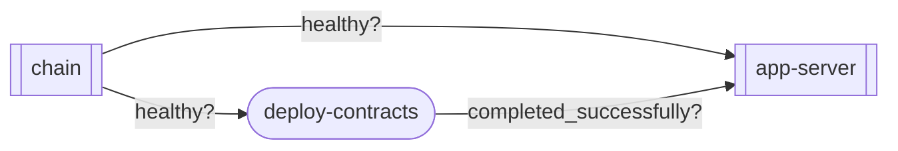

seahaven-project
----------------

[](./LICENSE)
[](https://github.com/LNSD/seahaven-project/actions/workflows/ci.yml)
[](https://codecov.io/gh/LNSD/seahaven-project)

> [!CAUTION]
> This is a work in progress and is not ready for production use.

<div align="center">
  
</div>

## The `setup.yaml` file

The `setup.yaml` file is a configuration file that describes your seahaven workspace.

```yaml
---
# Chain config
CHAIN_RPC: 8545
CHAIN_ID: 1337
CHAIN_NAME: "hardhat"

# App server
APP_SERVER_ADMIN: 7600
APP_SERVER_RPC: 7601
APP_SERVER_METRICS: 7602
---

services:
  chain:
    image: ghcr.io/foundry-rs/foundry:latest
    command: "anvil --host=0.0.0.0 --chain-id=${CHAIN_ID} --base-fee=0"
    ports: 
      - "${CHAIN_RPC}:8545"
    healthcheck: 
      { interval: 1s, retries: 10, test: cast block }

  app-server:
    image: ghcr.io/example/server:latest
    depends_on:
      chain: { condition: service_healthy }
      deploy-contracts: { condition: service_completed_successfully }
    ports: 
      - "${APP_SERVER_ADMIN}:7600"
      - "${APP_SERVER_RPC}:7601"
      - "${APP_SERVER_METRICS}:7602"
    healthcheck:
      { interval: 1s, retries: 10, test: curl -sf http://localhost:${APP_SERVER_ADMIN}/health }

init-containers:
  deploy-contracts:
    build: { context: contracts }
    depends_on:
      chain: { condition: service_healthy }
    volumes:
      - ./contracts.json:/opt/contracts.json:ro
```

<details>
<summary>Dependency graph</summary>


</details>

</br>

Based on the [Compose file format](https://github.com/compose-spec/compose-spec/blob/main/spec.md), the `setup.yaml` file allows you to define your seahaven workspace by declaring the different components and their dependencies.

## The `truman` CLI


The `truman` command is a CLI tool that allows you to manage your seahaven setup.

### Requirements

- A working Docker installation with `docker compose` installed.

### Installation

#### `cargo install`

The easiest way to install the CLI is to use `cargo` to install the `sehaven-cli` package and then use the `truman` binary.

```bash
cargo install sehaven-cli --bin truman --git https://github.com/LNSD/seahaven-project.git --locked
```

### Usage

```bash
truman --help
```

## License

<sup>
Licensed under <a href="LICENSE">Apache License, Version 2.0</a>.
</sup>

<br>

<sub>
Unless you explicitly state otherwise, any contribution intentionally submitted
for inclusion in this project, as defined in the Apache-2.0 license, shall be 
licensed as above, without any additional terms or conditions.
</sub>
